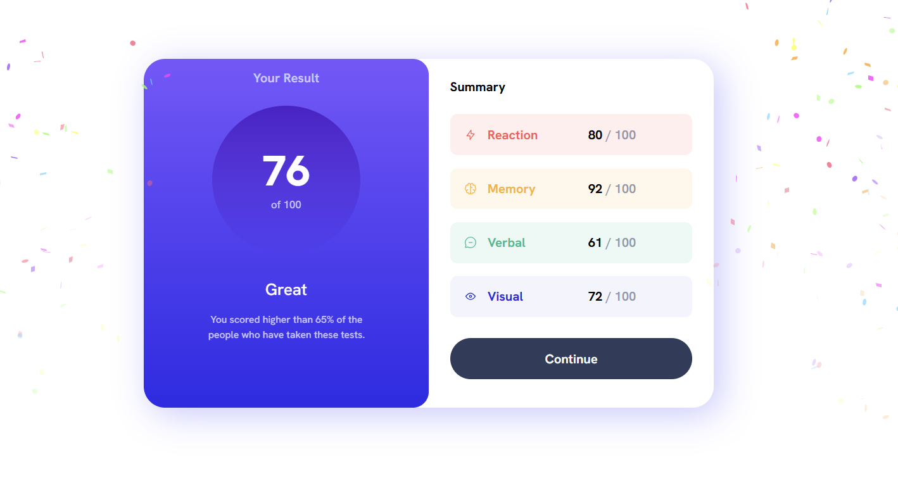

# Animated Webpage with CSS and Responsive Design

This project showcases a modern webpage styled with CSS, featuring animations, responsive design, and gradient color schemes. 
The layout is optimized for both desktop and mobile viewing, with an elegant and interactive user interface.

## Features

- **Custom Fonts**: Utilizes [Google Fonts](https://fonts.google.com/) for the "Hanken Grotesk" typeface.
- **Responsive Design**: Designed to adapt seamlessly to different screen sizes, with optimized styles for devices wider than 700px.
- **Animations**: Incorporates [Animate.css](https://animate.style/) for smooth entrance and hover effects.
- **CSS Variables**: Centralized theming using `:root` CSS variables for easy customization of colors and styles.
- **Gradients and Shadows**: Includes visually appealing linear gradients and box shadows.

# screenshot 

# Live preview is [here](https://amira-design3.surge.sh/)